[Chinese](./README.md)  |    [English](./README_english.md)

# WE 3D 渲染引擎 webGPU engine 3D

WE3D包括基础引擎和编辑器两大部分。（目前WE3D处于初期开发阶段，功能、模块与结构会频繁调整。）

1. 基础引擎部分包括：核心功能、图形学功能、模型功能、物理引擎整合、动画管理五个模块。
本项目：[https://github.com/WebgpuEngine/WE3D](https://)
当前开发版本文档：[https://WebgpuEngine.github.io/WE3D](https://)
2. npm 包
    npm 安装： npm i we3d
    npm发布地址：[https://www.npmjs.com/package/we3d](https://)
    npm发布版本文档 [https://github.com/WebgpuEngine/doc](https://)
3. doing ,示例代码   [https://github.com/WebgpuEngine/example](https://)
4. doing ,演示Demo  [https://github.com/WebgpuEngine/demo](https://)
5. todo,编辑器部分包括：材质编辑器、动画编辑器、场景编辑器，构建管理器四个模块，以实现可视化工作。在[https://github.com/WebgpuEngine/editor](https://)
6. todo,WE3D后期还会考虑减少后端服务，以实现支持服务器端活链接、USD、Nerf工作流、三维重构等以及AI适配等。

# 引擎基础说明

* WE 3D是使用typescript 和webGPU API 开发的web 端三维渲染引擎
* 在引擎基础部分涵盖场景、实体、纹理、材质、摄像机、光源、阴影、后处理、ECS、GPU拾取、AA、颜色空间、tonemapping、延迟渲染、BVH等；
* 在图形学的功能包括：IBL、SSGI、SSR、SSAO等
* 在物理引擎 上使用rapier进行物理引擎工作；
* 在模型部分：涉及gltf、obj、fbx等模型；
* 动画管理部分涵盖:关键帧、骨骼动画、变形目标、粒子系统等；
* 在渲染引擎的架构上是从底层独立设计与实现的，参考了Babylon、three、cesium、UE等；
* 在底层机制以command集合（Draw Command、Compute Command、Copy Command）进行shader提交；
* 在更新机制与事件机制上，以ECS为核心机制以及Event处理；

# 更多功能说明

* 支持sRGB和display P3的颜色空间，WE3D内部以linear的线性空间进行工作，支持多种模式的色彩映射输出；
* 光源支持环境光、方向光、点光源、聚光灯、面积光；
* 阴影实现以shadow map基础，支持PCSS;
* 在深度上支持正向Z和reveredZ，默认开启reversedZ;
* 支持MSAA，FXAA，并预计实现TAA。目前MSAA与延迟渲染不能同时使用（后期可能改进边缘检测后，支持同时使用）；
* 渲染模式支持前向渲染和延迟渲，透明物体渲染支持alpha透明和物理透明；
* 在渲染的GBuffer使用了多通道（单点56bit），数据覆盖color、depth、position、normal、albedo、roughness、metallic、ao、emissive、material、id等；
* 实体上支持mesh、lines、points，sprite，并支持实例化，在数据属性多种形式的属性组合的数组形式和ArrayBuffer形式数据；
* 在模型上支持gltf、obj、fbx等（进行中）。同时支持仿真数据、体渲染数据，并预计支持地理空间数据(todo);
* 材质支持简单材质、blinn-phong、PBR 材质；
* 摄像机支持正交与透视，且支持viewpot模式，多摄像机，多视图等；
* 拾取(pickup)支持两种模式，GPU端和CPU端，默认使用GPU端的拾取功能，CPU的ray功能配合BVH和物理引擎实现；
* 物理引擎整合rapier为主（进行中）；
* 渲染管理器内部支持多通道，涉及：计算、纹理、材质、渲染目标、不透明阴影、透明阴影、深度、MSAA、前向渲染、延迟渲染、透明渲染、sprite、sprite透明、toneMapping、后处理、ui、stage等诸多通道。各个通道会包括有内容线和时间线两种工作模式；
* 后处理是在有管理器和后处理功能组成，目前有FXAA，blue，colordemo等；
* stage有四个：默认的world，ui、stage1(导航等)，stage2（地图等）；
* ECS应用的比较多，比如实体、材质、光影、摄像机、输入管理、动画、纹理等都是采用的ECS的概念进行管理；
* 动画系统包括：关键帧(keyFrame)、变形目标(mophTarget)、骨骼动画、以及通过物理引擎实现的物理驱动动画；
* 体渲染材质有两个落地方案，一个是三维纹理的方案（3D采样），另一个是ray march的shader方案（实时计算）；
* 大气层方案，有实时积分方案，Bruneton方案，Hillaire方案；
* 在大气层上叠加的还有体积云，丁达尔光效，云阴影等；
* todo：粒子系统、SSGI、SSR、SSAO、TAA、

# 简单示例

| ReversedZ                                         | material alpha blend                             | pixel level alpha transparent material           |
| ------------------------------------------------- | ------------------------------------------------- | ------------------------------------------------- |
|  |  |  |
| 高光纹理 specular texture                         | 视差纹理 parallax texture                         | 法线纹理 normal texture                           |
|  |  |  |
| direction light +PCSS shadow                      | point light+PCSS shadow                           | spot light +PCSS shadow                           |
|  |  |  |
| 点光源+视差纹理                                   | viewpot                                           | PBR                                               |
|  |  |  |
| PBR                                               | PBR+spot+shadow                                   | PBR+point light+shadow                            |
|  |  |  |
| 1024个光源                                        | MSAA                                              | FXAA                                              |
|  |  |  |
| post process blue 3*3                             | post process red to 1                             | 延迟渲染 deferRender：PBR                         |
|  |  |  |
| 延迟渲染 deferRender：PBR                         | 延迟渲染 deferRebder：BlinnPhong                  | 延迟渲染 deferRebder：BlinnPhong                  |
|  |  |  |
| 骨骼动画 skeleton                                 | 变形目标 morph target                             | gltf Fox 骨骼动画                                 |
| 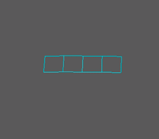 | 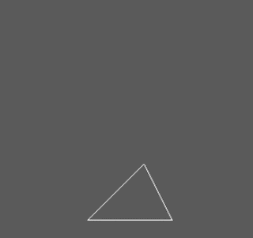 |  |
| gltf Hen 骨骼动画                                 | gltf LittlestTokyo                                | rapier demo with WE3D                             |
| 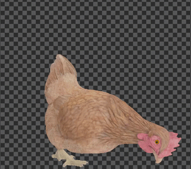 | 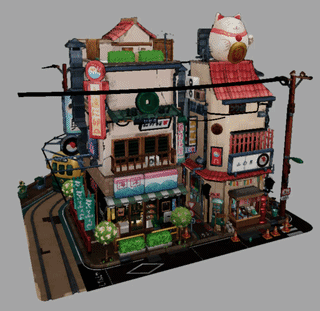 | 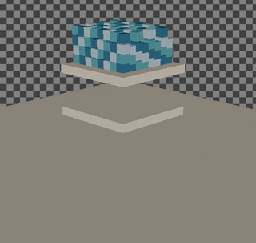 |
| PBR+IBL+SH                                        | PBR+IBL+SH+预览波+天空盒                          | 体渲染  3D 纹理                                  |
| 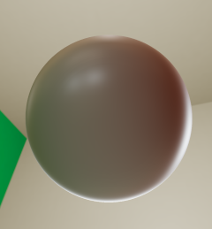 | 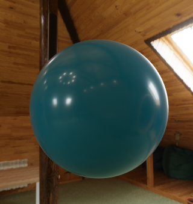 | 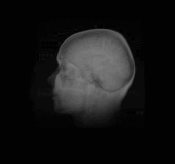 |
| 体渲染 ray march                                  | 大气层 实时积分计算                               | 大气层 Bruneton                                  |
| 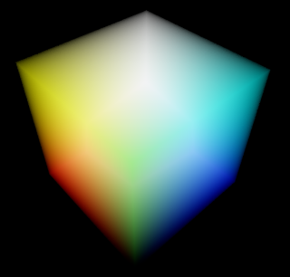 | 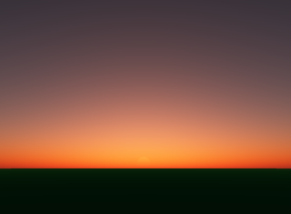 | 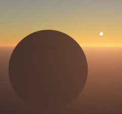 |
| 大气层 Hillaire LUT                              | 大气层 Hillaire ray march                        | 体积云                                            |
| 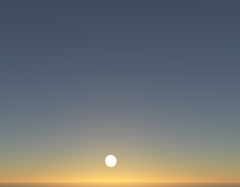 | 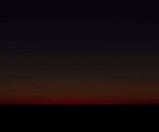 |                                                   |
| 大气层+云                                         | 大气层+云+阴影                                    | 大气层+云+丁达尔+云阴影                           |
|                                                   |                                                   |                                                   |
| SSAO                                              | SSGI                                              | SSR                                               |
|                                                   |                                                   |                                                   |
| 仿真云图                                          | 仿真等值线体渲染                                  | 仿真流线                                          |
|                                                   |                                                   |                                                   |
| clip 全局                                         | clip 局部                                         | clip sdf                                          |
|                                                   |                                                   |                                                   |
| 面积光                                            | 物理透明                                          | A-Buffer                                          |
|                                                   |                                                   |                                                   |
| 粒子系统                                          | 流体系统                                          |                                                   |
|                                                   |                                                   |                                                   |

# 资料参考与推荐

* webGPU标准：<https://www.w3.org/TR/webgpu/>
* WGSL的标准：<https://www.w3.org/TR/wgsl/>
* 非常好示例：<https://github.com/webgpu/webgpu-samples>
* google的Dawn：<https://github.com/google/dawn>
* Mozilla的wGPU：<https://github.com/gfx-rs/wgpu>
* MDN的webGPU文档：<https://developer.mozilla.org/zh-CN/docs/Web/API/WebGPU_API>
* 非常好的webGPU教程：<https://webgpufundamentals.org/>
* 非常好的webGL2教程：<https://webgl2fundamentals.org/>
* 非常好的webGL1教程：<https://webglfundamentals.org/>
* dawn 的C示例：<https://github.com/samdauwe/webgpu-native-examples>
* 非常实用的JS端的图形学简单数学库，这是目前主要使用的库：<https://github.com/greggman/wgpu-matrix>
* 另外一个经典的图形学数学库：<https://github.com/toji/gl-matrix>
* webGPU Samples <https://webgpu.github.io/webgpu-samples/>
* WebGPU API reference，方便实用：<https://gpuweb.github.io/types/index.html>
* webgpu-utils可以参考一下：<https://github.com/greggman/webgpu-utils>
* filament可以学习与参考一些：<https://github.com/google/filament>
* PBRT书籍，非常好：<https://www.pbr-book.org/>
* Ray tracing的书籍：<https://raytracing.github.io/>
* nvidia的书籍：<https://developer.nvidia.com/gpugems/gpugems/contributors>
* gltf文档 <https://registry.khronos.org/glTF/specs/2.0/>
* gltf tutorials  <https://github.com/KhronosGroup/glTF-Tutorials>
* rapier [Rapier physics engine | Rapier](https://rapier.rs/)
* [Bullet Real-Time Physics Simulation](https://pybullet.org/wordpress/)  <https://pybullet.org/>
* CSS Color Module Level 4 <https://www.w3.org/TR/css-color-4/>
* Self Shadow  <https://blog.selfshadow.com/>
* bruneton大气层： <https://ebruneton.github.io/precomputed_atmospheric_scattering/>
* Hillaire大气层方案的webgpu实现：<https://github.com/JolifantoBambla/webgpu-sky-atmosphere>
* Sebastien Hillaire的 Unreal Engine 示例仓库，<https://github.com/sebh/UnrealEngineSkyAtmosphere>
*
