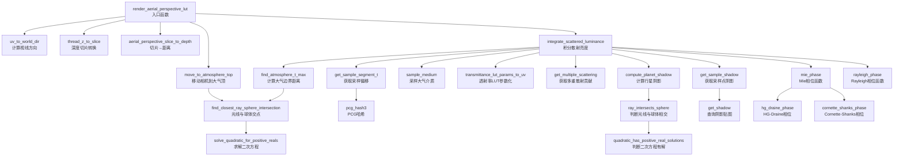
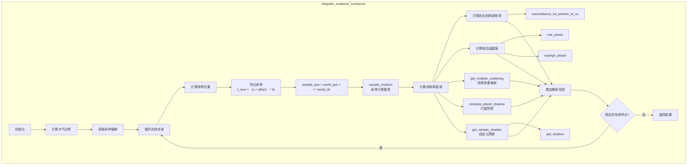
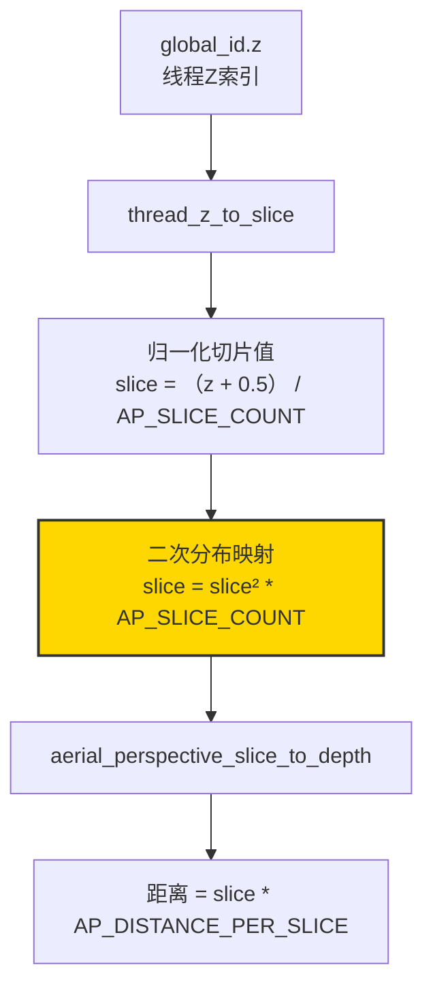
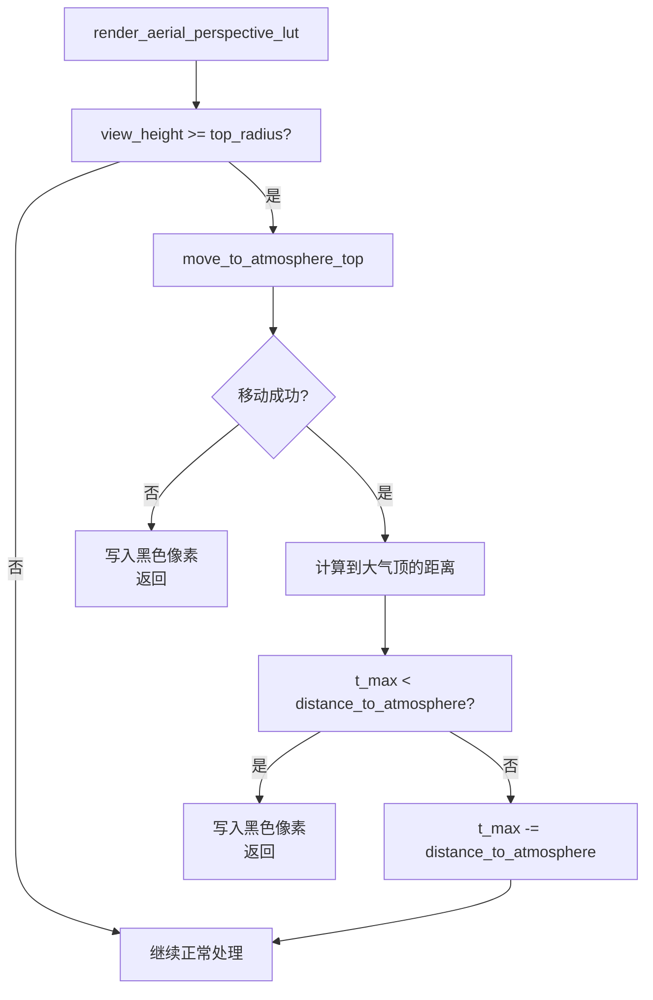
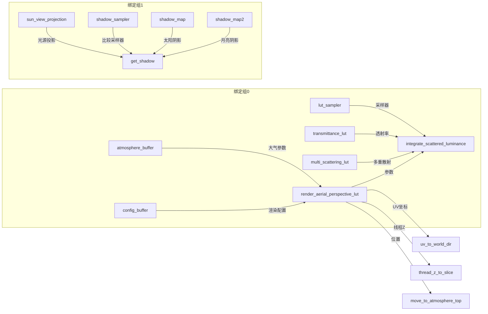
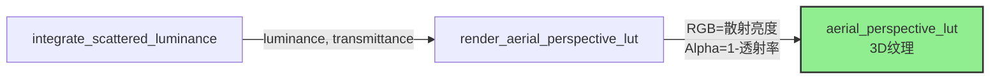
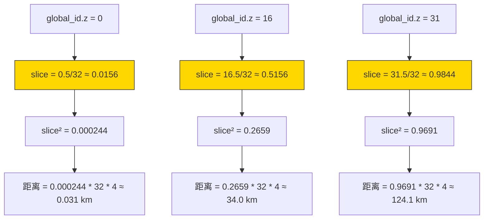

# exp_lut_AP.wgsl 函数调用关系分析

## 1. 文件概述

`exp_lut_AP.wgsl` 是 **Aerial Perspective LUT**（大气透视查找表）的完整渲染着色器，用于预计算从相机到不同深度的大气散射效果。该着色器采用 **Compute Shader** 架构，每个线程负责计算 3D LUT 中的一个体素。

**核心功能**：
- 对每个深度切片计算从观察者到该深度的散射亮度和透射率
- 支持自定义阴影（城市建筑物遮挡太阳光）
- 支持双光源（太阳 + 月亮）
- 使用 Ray Marching 进行光线积分

**LUT 结构**：3D 纹理 `[width, height, depth_slices]`
- **XY**：屏幕 UV 坐标（对应视线方向）
- **Z**：深度切片（对应距离，默认每层 4 千米，共 32 层）

---

## 2. 函数调用流程图

### 2.1 主入口函数调用链



### 2.2 核心积分函数调用关系



### 2.3 深度切片参数化流程



### 2.4 相机外处理流程



---

## 3. 函数调用关系表

| 层级 | 函数名 | 调用者 | 被调用 | 功能描述 |
|------|--------|--------|--------|----------|
| **入口** | `render_aerial_perspective_lut` | - | uv_to_world_dir, thread_z_to_slice, move_to_atmosphere_top, integrate_scattered_luminance | 主入口，计算3D LUT体素 |
| **方向计算** | `uv_to_world_dir` | render_aerial_perspective_lut | depth_max | 将UV转换为世界空间方向 |
| **深度参数化** | `thread_z_to_slice` | render_aerial_perspective_lut | - | 线程Z索引→深度切片（二次分布） |
| **深度参数化** | `aerial_perspective_slice_to_depth` | render_aerial_perspective_lut | - | 切片→距离 |
| **几何计算** | `move_to_atmosphere_top` | render_aerial_perspective_lut | find_closest_ray_sphere_intersection | 将相机移动到大气顶部 |
| **核心积分** | `integrate_scattered_luminance` | render_aerial_perspective_lut | 多个函数 | 光线步进积分散射亮度 |
| **采样偏移** | `get_sample_segment_t` | integrate_scattered_luminance | pcg_hash3 | 获取采样点随机偏移 |
| **哈希函数** | `pcg_hash3` | get_sample_segment_t | pcg_hashf | 三维PCG哈希 |
| **哈希函数** | `pcg_hashf` | pcg_hash3 | pcg_hash | 浮点PCG哈希 |
| **哈希函数** | `pcg_hash` | pcg_hashf | - | 整数PCG哈希 |
| **几何计算** | `find_atmosphere_t_max` | integrate_scattered_luminance | find_closest_ray_sphere_intersection | 计算光线在大气中的最大距离 |
| **几何计算** | `find_closest_ray_sphere_intersection` | find_atmosphere_t_max, move_to_atmosphere_top | solve_quadratic_for_positive_reals | 光线与球体最近交点 |
| **数学工具** | `solve_quadratic_for_positive_reals` | find_closest_ray_sphere_intersection | - | 求解二次方程最小正根 |
| **介质采样** | `sample_medium` | integrate_scattered_luminance | - | 采样大气介质属性 |
| **LUT参数化** | `transmittance_lut_params_to_uv` | integrate_scattered_luminance | - | 透射率LUT坐标转换 |
| **多重散射** | `get_multiple_scattering` | integrate_scattered_luminance | from_unit_to_sub_uvs | 查询多重散射LUT |
| **阴影计算** | `compute_planet_shadow` | integrate_scattered_luminance | ray_intersects_sphere | 计算行星遮挡阴影 |
| **阴影计算** | `ray_intersects_sphere` | compute_planet_shadow | quadratic_has_positive_real_solutions | 判断光线与球体相交 |
| **数学工具** | `quadratic_has_positive_real_solutions` | ray_intersects_sphere | - | 判断二次方程有正根 |
| **阴影查询** | `get_sample_shadow` | integrate_scattered_luminance | get_shadow | 封装阴影查询 |
| **阴影查询** | `get_shadow` | get_sample_shadow | - | 采样自定义阴影贴图 |
| **相位函数** | `mie_phase` | integrate_scattered_luminance | hg_draine_phase, cornette_shanks_phase | Mie散射相位函数 |
| **相位函数** | `rayleigh_phase` | integrate_scattered_luminance | - | Rayleigh散射相位函数 |

---

## 4. 数据流分析

### 4.1 输入数据流向



### 4.2 输出数据流向



---

## 5. 与 Sky View LUT 的关键区别

| 特性 | Sky View LUT | Aerial Perspective LUT |
|------|--------------|------------------------|
| **输出纹理** | 2D 纹理 | 3D 纹理（增加深度维度） |
| **线程组织** | `global_id.xy` → LUT像素 | `global_id.xyz` → LUT体素 |
| **方向计算** | `compute_world_dir`（自定义参数化） | `uv_to_world_dir`（基于投影矩阵） |
| **采样分布** | 非线性二次分布（近处密集） | 均匀采样（+随机偏移） |
| **采样数** | 基于距离动态计算 | 基于深度切片：`(z + 1) * 2` |
| **相机外处理** | 简单移动到大气顶 | 复杂逻辑：检查目标深度是否在大气内 |
| **地面相交处理** | 不处理（天空方向） | 处理：将切片位置提升到地面上方 |

---

## 6. 关键算法流程

### 6.1 光线步进积分算法（AP版本）

```mermaid
flowchart TD
    A[开始积分] --> B[计算t_max<br/>光线与大气边界交点]
    B --> C[获取采样偏移<br/>随机或固定0.3]
    C --> D{采样循环}
    
    D --> E[均匀采样位置<br/>t_new = (s + offset) * dt]
    E --> F[sample_pos = world_pos + t * world_dir]
    
    F --> G[sample_medium<br/>获取散射/消光系数]
    G --> H[计算局部透射率<br/>exp(-extinction * dt)]
    
    H --> I[查询透射率LUT<br/>采样点→光源]
    H --> J[计算相位函数值]
    H --> K[查询多重散射LUT]
    H --> L[计算阴影因子]
    
    I & J & K & L --> M[计算散射亮度]
    M --> N[累加积分结果]
    N --> O[更新累计透射率]
    O --> D
    
    D -->|结束| P[返回散射亮度和透射率]
```

### 6.2 深度切片二次分布



> **设计意图**：使用二次函数 `slice²` 映射深度切片，使得靠近相机的区域切片更密集（距离分辨率更高），远处区域切片稀疏。这是因为近处物体的大气透视效果变化更剧烈，需要更高的分辨率。

---

## 7. shadow_map / shadow_map2 分析

### 7.1 结论：**shadow_map 和 shadow_map2 不是必须的，可以移除**

### 7.2 用途分析

`shadow_map` 和 `shadow_map2` 用于实现**自定义阴影查询**，例如城市建筑物遮挡太阳光的效果。它们在代码中的使用位置：

```wgsl
// 第921行：太阳阴影
let shadow = get_sample_shadow(atmosphere, sample_pos, 0);

// 第933行：月亮阴影（仅USE_MOON=true时）
let shadow_moon = get_sample_shadow(atmosphere, sample_pos, 1);
```

最终在散射亮度计算中参与：
```wgsl
scattered_luminance = sun_illuminance * (planet_shadow * shadow * transmittance_to_sun * ...)
```

### 7.3 非必须的原因

**方案对比**：

| 方案 | 说明 | 效果 |
|------|------|------|
| **保留 shadow_map** | 需要绑定组1的完整资源（投影矩阵、比较采样器、深度纹理） | 支持自定义阴影（城市遮挡等） |
| **移除 shadow_map** | 修改 `get_shadow` 函数始终返回 `1.0` | 仅保留行星阴影，不影响基本大气透视渲染 |

**关键区别**：
- `compute_planet_shadow`：**内置功能**，计算行星自身对光线的遮挡（例如地球挡住太阳光）
- `get_sample_shadow` → `get_shadow`：**可选功能**，查询外部阴影贴图（例如建筑物阴影）

### 7.4 移除方案

如果不需要自定义阴影，可以修改 `get_shadow` 函数：

```wgsl
fn get_shadow(p: vec3<f32>, light_index: u32) -> f32 {
    return 1.0;  // 始终返回完全光照
}
```

同时移除绑定组1的资源绑定：
```wgsl
// 删除以下行：
@group(1) @binding(0) var<uniform> sun_view_projection: array<mat4x4<f32>, 2>;
@group(1) @binding(1) var shadow_sampler: sampler_comparison;
@group(1) @binding(2) var shadow_map: texture_depth_2d;
@group(1) @binding(3) var shadow_map2: texture_depth_2d;
```

### 7.5 设计模式

项目采用了**模板方法模式**来处理阴影：
- `common/shadow_base.wgsl` 提供 `get_sample_shadow` 的封装
- 具体的 `get_shadow` 实现由各着色器文件提供（或注入）
- 这样设计使得阴影功能可以按需启用/禁用

---

## 8. 总结

### 函数调用层次结构

```
render_aerial_perspective_lut (入口)
├── uv_to_world_dir (方向计算)
│   └── depth_max
├── thread_z_to_slice (深度参数化)
├── aerial_perspective_slice_to_depth (深度参数化)
├── move_to_atmosphere_top (几何调整)
│   └── find_closest_ray_sphere_intersection
│       └── solve_quadratic_for_positive_reals
└── integrate_scattered_luminance (核心积分)
    ├── get_sample_segment_t
    │   ├── pcg_hash3
    │   │   └── pcg_hashf
    │   │       └── pcg_hash
    ├── find_atmosphere_t_max
    │   └── find_closest_ray_sphere_intersection
    ├── sample_medium
    ├── transmittance_lut_params_to_uv
    ├── get_multiple_scattering
    │   └── from_unit_to_sub_uvs
    ├── compute_planet_shadow
    │   └── ray_intersects_sphere
    │       └── quadratic_has_positive_real_solutions
    ├── get_sample_shadow
    │   └── get_shadow
    ├── mie_phase
    │   ├── hg_draine_phase (可选)
    │   └── cornette_shanks_phase (可选)
    └── rayleigh_phase
```

### 关键设计特点

1. **3D LUT 架构**：使用 3D 纹理存储，支持任意深度的大气透视查询
2. **二次深度分布**：近处切片密集，远处稀疏，平衡精度与性能
3. **均匀采样**：与 Sky View LUT 的非线性采样不同，AP 使用均匀采样 + 随机偏移
4. **动态采样数**：采样数随深度增加而增加（`(z + 1) * 2`）
5. **复杂边界处理**：处理相机在大气外、光线与地面相交等边界情况
6. **可选功能**：阴影贴图、月亮光源均通过 override 参数控制
