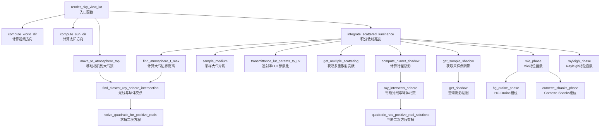
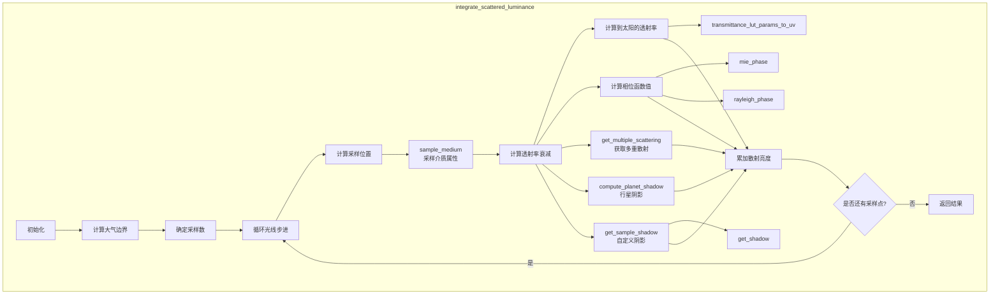
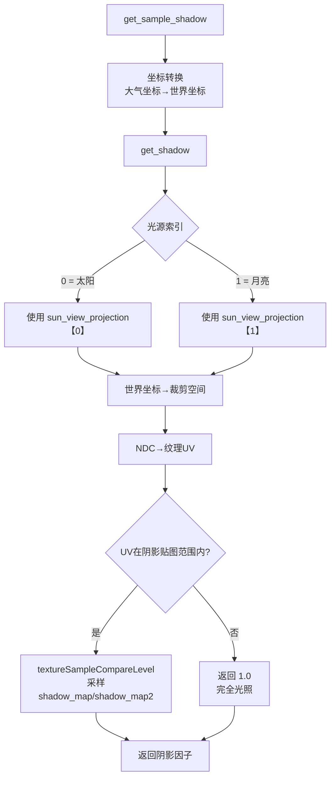
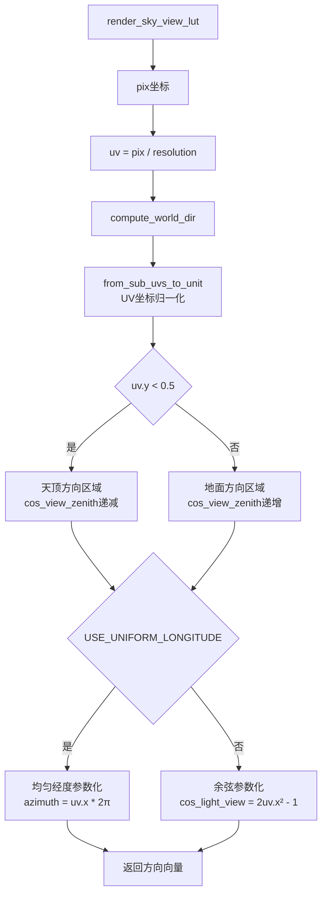
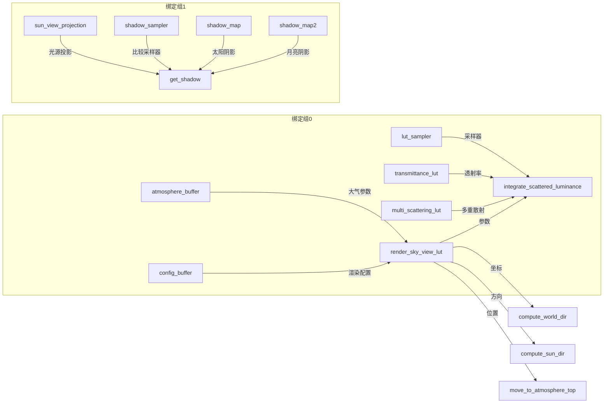
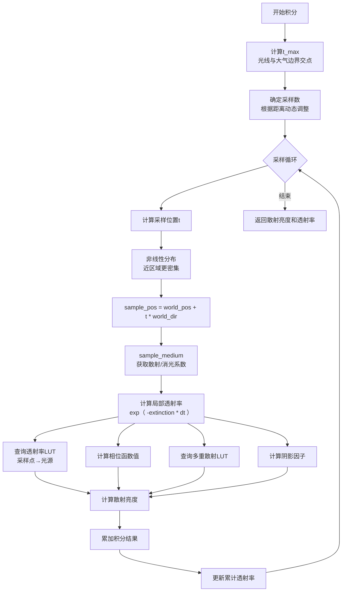
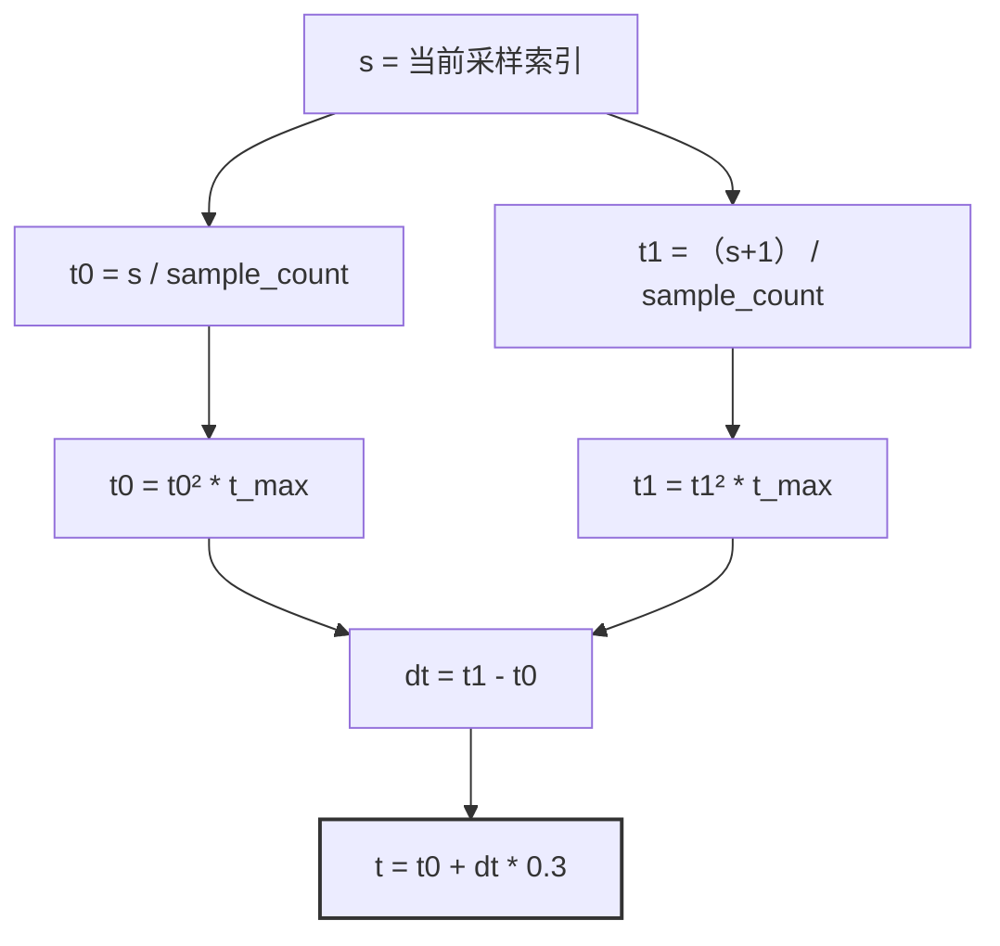

# exp_lut_skyview.wgsl 函数调用关系分析

## 1. 文件概述

`exp_lut_skyview.wgsl` 是天空视图 LUT（Sky View Lookup Table）的完整渲染着色器，用于预计算每个方向的天空散射亮度。该着色器采用 **Compute Shader** 架构，每个线程负责计算 LUT 中的一个像素。

**核心功能**：
- 对每个 LUT 像素计算对应方向的散射亮度（单次散射 + 多重散射）
- 支持自定义阴影（城市建筑物遮挡太阳光）
- 支持双光源（太阳 + 月亮）
- 使用 Ray Marching 进行光线积分

---

## 2. 函数调用流程图

### 2.1 主入口函数调用链



### 2.2 核心积分函数调用关系



### 2.3 阴影查询流程



### 2.4 方向参数化流程



---

## 3. 函数调用关系表

| 层级 | 函数名 | 调用者 | 被调用 | 功能描述 |
|------|--------|--------|--------|----------|
| **入口** | `render_sky_view_lut` | - | compute_world_dir, compute_sun_dir, move_to_atmosphere_top, integrate_scattered_luminance | 主入口，计算单个LUT像素 |
| **方向计算** | `compute_world_dir` | render_sky_view_lut | from_sub_uvs_to_unit | 将UV转换为3D方向向量 |
| **方向计算** | `compute_sun_dir` | render_sky_view_lut | to_z_up_left_handed | 将太阳方向转换到LUT坐标系 |
| **几何计算** | `move_to_atmosphere_top` | render_sky_view_lut | find_closest_ray_sphere_intersection | 将相机移动到大气顶部 |
| **核心积分** | `integrate_scattered_luminance` | render_sky_view_lut | 多个函数 | 光线步进积分散射亮度 |
| **几何计算** | `find_atmosphere_t_max` | integrate_scattered_luminance | find_closest_ray_sphere_intersection | 计算光线在大气中的最大距离 |
| **几何计算** | `find_closest_ray_sphere_intersection` | find_atmosphere_t_max, move_to_atmosphere_top | solve_quadratic_for_positive_reals | 光线与球体最近交点 |
| **数学工具** | `solve_quadratic_for_positive_reals` | find_closest_ray_sphere_intersection | - | 求解二次方程最小正根 |
| **介质采样** | `sample_medium` | integrate_scattered_luminance | - | 采样大气介质属性 |
| **LUT参数化** | `transmittance_lut_params_to_uv` | integrate_scattered_luminance | - | 透射率LUT坐标转换 |
| **多重散射** | `get_multiple_scattering` | integrate_scattered_luminance | from_unit_to_sub_uvs | 查询多重散射LUT |
| **阴影计算** | `compute_planet_shadow` | integrate_scattered_luminance | ray_intersects_sphere | 计算行星遮挡阴影 |
| **阴影计算** | `ray_intersects_sphere` | compute_planet_shadow | quadratic_has_positive_real_solutions | 判断光线与球体相交 |
| **数学工具** | `quadratic_has_positive_real_solutions` | ray_intersects_sphere | - | 判断二次方程有正根 |
| **阴影查询** | `get_sample_shadow` | integrate_scattered_luminance | get_shadow | 封装阴影查询 |
| **阴影查询** | `get_shadow` | get_sample_shadow | - | 采样自定义阴影贴图 |
| **相位函数** | `mie_phase` | integrate_scattered_luminance | hg_draine_phase, cornette_shanks_phase | Mie散射相位函数 |
| **相位函数** | `rayleigh_phase` | integrate_scattered_luminance | - | Rayleigh散射相位函数 |

---

## 4. 数据流分析

### 4.1 输入数据流向



### 4.2 输出数据流向


---

## 5. 关键算法流程

### 5.1 光线步进积分算法



### 5.2 非线性采样分布



> **设计意图**：使用二次函数 `t²` 映射采样位置，使得靠近观察者的区域采样更密集，提高近处散射计算的精度。`sample_segment_t = 0.3` 表示采样点位于分段的 30% 位置，而非中心，这是为了减少数值误差。

---

## 6. 总结

### 函数调用层次结构

```
render_sky_view_lut (入口)
├── compute_world_dir (方向参数化)
│   └── from_sub_uvs_to_unit
├── compute_sun_dir (方向转换)
│   └── to_z_up_left_handed
├── move_to_atmosphere_top (几何调整)
│   └── find_closest_ray_sphere_intersection
│       └── solve_quadratic_for_positive_reals
└── integrate_scattered_luminance (核心积分)
    ├── find_atmosphere_t_max
    │   └── find_closest_ray_sphere_intersection
    ├── sample_medium
    ├── transmittance_lut_params_to_uv
    ├── get_multiple_scattering
    │   └── from_unit_to_sub_uvs
    ├── compute_planet_shadow
    │   └── ray_intersects_sphere
    │       └── quadratic_has_positive_real_solutions
    ├── get_sample_shadow
    │   └── get_shadow
    ├── mie_phase
    │   ├── hg_draine_phase (可选)
    │   └── cornette_shanks_phase (可选)
    └── rayleigh_phase
```

### 关键设计特点

1. **并行架构**：每个线程独立计算一个 LUT 像素，无数据依赖
2. **非线性采样**：使用二次分布提高近处采样密度
3. **LUT 加速**：预计算透射率和多重散射，避免实时积分
4. **可选功能**：阴影贴图、月亮光源均通过 override 参数控制
5. **坐标系统抽象**：支持多种坐标系配置（Y/Z 轴向上、左右手坐标系）
